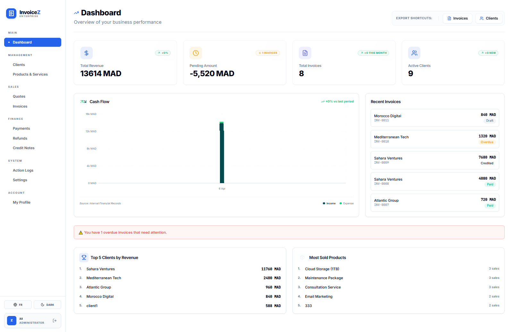
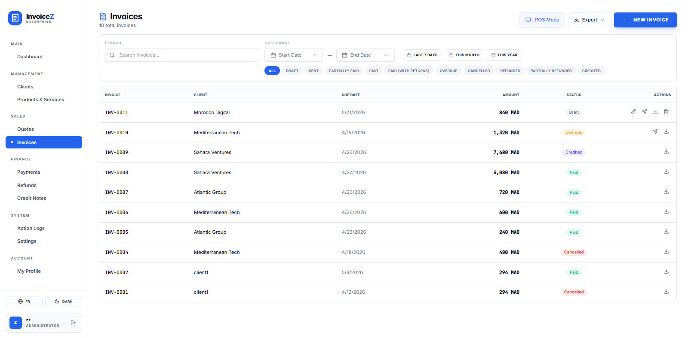
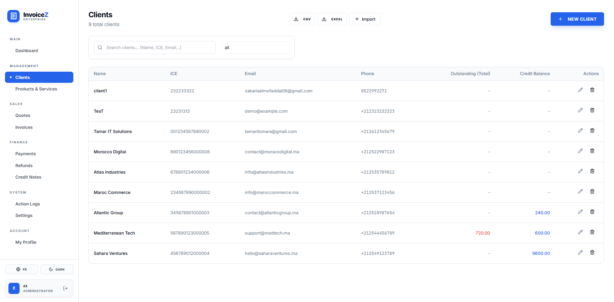
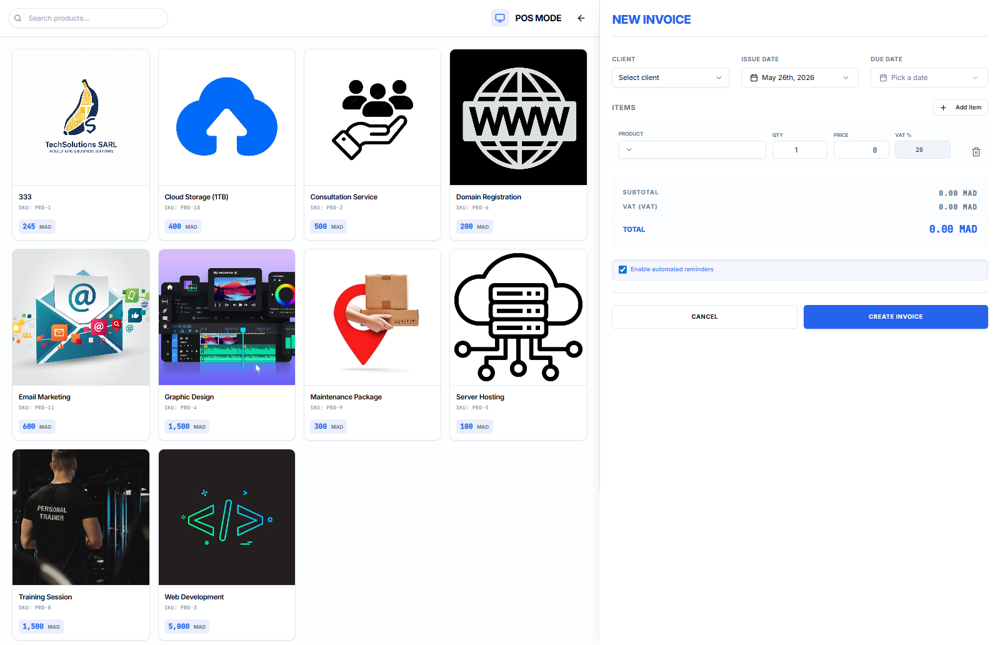

# 📊 Invoice Manager - Professional Showcase

> A modern, full-featured invoice management system built with cutting-edge web technologies.

**Live Demo:** [http://app.ifry.ma/](http://app.ifry.ma/)

## 🖼️ Screenshots

Dashboard and key screens from the live application:

---

## 🎯 Overview

Invoice Manager is a complete invoice management solution designed for businesses of all sizes. It combines an intuitive React frontend with a robust Express backend, enabling seamless invoice creation, tracking, and management.

### Key Highlights

- ✅ **Production-Ready**: Fully deployed and actively used in production
- ⚡ **High Performance**: Optimized frontend with Vite and React Query
- 🔐 **Enterprise Security**: JWT authentication, role-based access control, rate limiting
- 📄 **PDF Generation**: Professional invoice & quote PDF exports
- 💰 **Multiple Payment States**: Track invoices through various states (Draft, Sent, Paid, Refunded, etc.)
- 📊 **Smart Analytics**: Payment tracking, credit management, audit logging
- 🌍 **Localization Ready**: Multi-language support architecture
- 📧 **Automated Notifications**: Email reminders and notifications
- 📦 **Inventory Management**: Track products and stock movements
- 🛡️ **Role-Based Access**: Granular permission system

---

## 🏗️ Architecture

### Tech Stack

**Backend:**
- **Framework**: Express.js with TypeScript
- **Database**: PostgreSQL with Prisma ORM
- **Authentication**: JWT + bcrypt password hashing
- **PDF Generation**: pdf-lib with custom templating
- **Email**: Nodemailer integration
- **Security**: Helmet, CORS, XSS protection, rate limiting
- **Scheduling**: Node-cron for automated tasks
- **Data Export**: Excel (ExcelJS), CSV (json2csv)

**Frontend:**
- **Framework**: React 18+ with TypeScript
- **Build Tool**: Vite (lightning-fast bundling)
- **UI Components**: shadcn/ui (Radix UI + Tailwind)
- **Styling**: Tailwind CSS with custom configuration
- **State Management**: React Query for server state
- **Forms**: React Hook Form with Zod validation
- **Testing**: Vitest for unit & integration tests

### Database Schema

The system manages:
- **Users & Roles**: Multi-user support with role-based permissions
- **Clients**: Business client management with credit tracking
- **Invoices**: Full invoice lifecycle (Draft → Paid → Settled)
- **Quotes**: Quote generation and conversion to invoices
- **Products**: Product catalog with pricing and tax calculation
- **Payments & Refunds**: Complete payment tracking and refund management
- **Credit Notes**: Customer credit management and utilization
- **Stock Movements**: Inventory tracking and adjustments
- **Audit Logs**: Complete activity history for compliance

---

## 💡 Core Features

### Invoice Management
- Create, edit, and manage invoices with intuitive interface
- Multiple status tracking: Draft, Sent, Paid, Partially Paid, Overdue, Cancelled, Refunded, Credited
- Automatic invoice numbering
- Customizable terms and legal mentions
- Digital signature support
- Multi-currency support (default: MAD)

### Quotes & Conversion
- Generate professional quotes
- Convert quotes to invoices seamlessly
- Track quote status and responses

### Payment Processing
- Record multiple payments per invoice
- Partial payment support
- Payment tracking dashboard
- Overdue invoice alerts
- Automatic reminder system

### Financial Management
- Credit note generation
- Refund processing
- Credit balance tracking and auto-application
- Settlement tracking
- Return handling

### Product & Inventory
- Product catalog management
- SKU tracking
- Price and tax configuration
- Stock movement history
- Inventory adjustments

### Reporting & Analytics
- Payment status overview
- Invoice aging reports
- Client credit analysis
- Stock movement tracking
- Audit trail for compliance

### Administrative Features
- User & role management
- Multi-level access control
- Rate limiting & security
- Data validation & XSS protection
- Scheduled tasks & cron jobs

---

## 🎨 User Experience

### Frontend Capabilities
- **Responsive Design**: Works seamlessly on desktop, tablet, and mobile
- **Real-time Updates**: React Query for efficient data fetching
- **Accessible UI**: WCAG-compliant Radix UI components
- **Command Palette**: Quick navigation with keyboard shortcuts
- **Dark Mode Support**: Theme customization (Tailwind CSS)
- **Localization**: i18n ready for multiple languages

### Key Workflows
1. **Create & Send Invoice**: Fill form → Generate PDF → Send to client
2. **Track Payment**: Monitor payment status → Record receipt → Update balance
3. **Issue Credit**: Generate credit note → Apply credit to next invoice
4. **Manage Inventory**: Update product stock → Track movement history
5. **Admin Tasks**: Manage users, roles, and system settings

---

## 🚀 Deployment

The application is deployed and running live at:
🔗 **[http://app.ifry.ma/](http://app.ifry.ma/)**

### Infrastructure
- Frontend: Optimized Vite build deployment
- Backend: Node.js server with Express
- Database: PostgreSQL with migrations
- PDF Service: Dedicated PDF generation microservice

---

## 📈 Performance Metrics

- **Frontend Load Time**: < 2 seconds (optimized bundle)
- **API Response Time**: < 200ms average (database queries)
- **PDF Generation**: < 5 seconds per document
- **Database**: PostgreSQL with optimized queries
- **Uptime**: Production-grade stability

---

## 🔒 Security Features

- ✅ **Authentication**: Session-based JWT tokens
- ✅ **Authorization**: Role-based access control (RBAC)
- ✅ **Password Security**: bcrypt hashing with salt rounds
- ✅ **Rate Limiting**: API endpoints protected against brute force
- ✅ **XSS Protection**: Sanitization with xss-clean
- ✅ **CORS**: Configured for secure cross-origin requests
- ✅ **HTTPS Ready**: Helmet security headers
- ✅ **Data Validation**: Zod schema validation throughout
- ✅ **Audit Logging**: Complete activity tracking

---

## 📚 API Overview

The backend provides a comprehensive REST API with:
- **Authentication Endpoints**: Login, registration, token refresh
- **Invoice Routes**: CRUD operations, PDF generation, status updates
- **Quote Routes**: Quote management and conversion
- **Payment Routes**: Payment recording and tracking
- **Client Routes**: Client data management
- **Product Routes**: Product catalog management
- **User Routes**: User & role administration
- **Audit Routes**: Activity logging and reporting

All endpoints are authenticated and authorized based on user roles.

---

## 🎯 Use Cases

### Small Businesses
Perfect for freelancers, consultants, and small service providers managing client invoicing.

### E-Commerce
Ideal for online stores needing invoice generation, refund management, and payment tracking.

### Professional Services
Built for agencies, studios, and firms handling multiple projects and clients.

### Retail & Distribution
Complete inventory and invoice management for product-based businesses.

### Financial Organizations
Audit logging, multi-user roles, and compliance features for regulated environments.

---

## 🌟 Highlights

- **Production Tested**: Currently in active use and continuously improved
- **Scalable Architecture**: Modular design supporting growth
- **Developer Friendly**: TypeScript throughout for type safety
- **Well-Organized**: Clear separation of concerns and clean code structure
- **Modern Stack**: Latest tools and frameworks (Vite, React 18, Prisma 6)
- **Extensible**: Easy to add new features and integrations

---

## 📞 Contact & Information

This is a fully functional, production-grade invoice management system ready for enterprise adoption.

**Explore the live demo:** [http://app.ifry.ma/](http://app.ifry.ma/)

---

*Invoice Manager | © 2026 | Production-Ready Solution*
